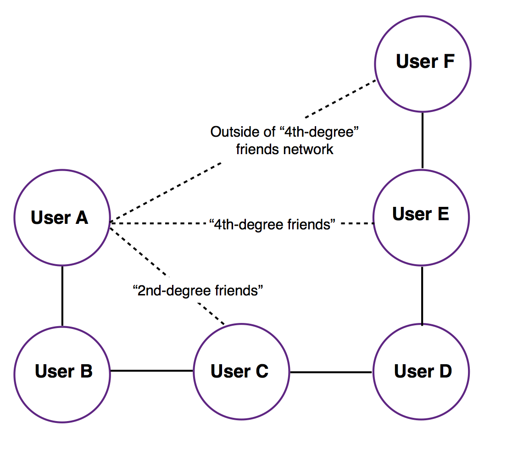

# Table of Contents

1.[Overview] (README.md#overview)
2.[Instructions] (README.md#instructions)
3.[Description of Data] (README.md#description-of-data)
4.[Unit Tests] (README.md#unit-tests)
5.[Directory Structure] (README.md#directory-structure)

## Overview
This is my submission for the Insight Data Engineering Application Jan 2017 cycle. This application uses data from a fictional "digital wallet" company called PayMo that allows users to easily request and make payments to other PayMo users. The team at PayMo has decided they want to implement features to prevent fraudulent payment requests from untrusted users.
While PayMo is a fictional company, the dataset is quite interesting -- it's inspired by a real social network, includes the time of transaction, and the messages come from real Venmo transactions.

### Feature 1
When anyone makes a payment to another user, they'll be notified if they've never made a transaction with that user before.

* "unverified: You've never had a transaction with this user before. Are you sure you would like to proceed with this payment?"

### Feature 2
The PayMo team is concerned that these warnings could be annoying because there are many users who haven't had transactions, but are still in similar social networks. 

For example, User A has never had a transaction with User B, but both User A and User B have made transactions with User C, so User B is considered a "friend of a friend" for User A.

For this reason, User A and User B should be able to pay each other without triggering a warning notification since they're "2nd degree" friends. 

To account for this, in this feature, users will only be notified when they make a payment to someone who is not "a friend of a friend".

* "unverified: This user is not a friend or a "friend of a friend". Are you sure you would like to proceed with this payment?"

### Feature 3
More generally, PayMo would like to extend this feature to larger social networks. This feature warns users only when they're outside the "4th degree friends network".

In the above diagram, payments have transpired between User

* A and B 
* B and C 
* C and D 
* D and E 
* E and F

Under this feature, if User A were to pay User E, there would be no warning since they are "4th degree friends". 

However, if User A were to pay User F, a warning would be triggered as their transaction is outside of the "4th-degree friends network" (Note that if User A were to pay User C instead, there would be no warning as they are "2nd-degree" friends and within the "4th degree network").

### Feature 4
After examining their fraudulent transactions data, PayMo has decided that verifying transactions beyond "3rd-degree friends networks" is optimal.

Furthermore, this feature now examines transaction messages and emojis between users to determine what activity the transaction was used for. This provides us with
valuable data for targeted advertisements on the expanding PayMo platform. Specifically, this feature determines whether a transactions was used for transportation,
food, partying/alcohol, clothing, or miscellaneous reasons. For example, this data can later be used to direct Uber ads towards users who frequently use PayMo for transportation.

## Instructions

* Clone the directory using `git clone https://github.com/anuvedverma/digital-wallet.git`
* To run the included tests, run the following from the `insight_testsuite` directory:
    * To run tests for the first 3 features, run the following in your command prompt: `./run_tests.sh`
    * To run tests for the additional 4th feature, run the following in your command prompt: `./run_tests2.sh`
* To run the program with custom inputs, edit the last line in the `run.sh` BASH file of the `digital-wallet` directory as follows:
    * `java PaymoDriver <dir-to-input-batch-payment-file> <dir-to-input-stream-payment-file> <dir-to-output1-file> <dir-to-output2-file> <dir-to-output3-file> <dir-to-output4-file>`

### Input

The data for this application resides in two comma-delimited files in the `paymo_input` directory. 

The first file, `batch_payment.txt`, contains past data that can be used to track users who have previously paid one another. These transactions should be used to build the initial state of the entire user network.

Data in the second file, `stream_payment.txt` should be used to determine whether there's a possibility of fraud and a warning should be triggered.

Each new line of `stream_payment.txt` corresponds to a new, valid PayMo payment record -- regardless of being 'unverified' -- and design your program to handle a text file with a large number of payments. 

### Output

The code processes each line in `stream_payment.txt` and for each payment, outputs a line containing one of two words, `trusted` or `unverified`. 

`trusted` means the two users involved in the transaction have previously paid one another (when implementing Feature 1) or are part of the "friends network" (when implementing Feature 2 and 3).

`unverified` means the two users have not previously been involved in a transaction (when implementing Feature 1) or are outside of the "friends network" (when implementing Features 2 and 3).

For Feature 4, the output will have an additional field to indicate the types of goods/services this transaction was used to pay for. The output is a line containing
either `trusted` or `unverified`, followed a by the types of transactions this payment qualifies for, separated by a colon. So for a message containing the text `taxis and booze`,
we might see the output line `trusted: transportation, party-related`.

The output should be written to a text file in the `paymo_output` directory. Each output file is named after the applicable feature implemented: `output1.txt`, `output2.txt`, `output3.txt`, and `output4.txt`.

## Description of Data

[Back to Table of Contents] (README.md#table-of-contents)

The `batch_payment.txt` and `stream_payment.txt` input files are formatted the same way.

The first line is the header, which contains the names of all of the fields in the payment record. In this case, the fields are 

* `time`: Timestamp for the payment 
* `id1`: ID of the user making the payment 
* `id2`: ID of the user receiving the payment 
* `amount`: Amount of the payment 
* `message`: Any message the payer wants to associate with the transaction

Following the header, each new line contains a single new PayMo payment record with each field delimited by a comma.

For example, the first 10 lines (including the header) of `batch_payment.txt` or `stream_payment.txt` could look like: 

	time, id1, id2, amount, message
	2016-11-02 09:49:29, 52575, 1120, 25.32, Spam
	2016-11-02 09:49:29, 47424, 5995, 19.45, Food for 🌽 😎
	2016-11-02 09:49:29, 76352, 64866, 14.99, Clothing
	2016-11-02 09:49:29, 20449, 1552, 13.48, LoveWins
	2016-11-02 09:49:29, 28505, 45177, 19.01, 🌞🍻🌲🏔🍆
	2016-11-02 09:49:29, 56157, 16725, 4.85, 5
	2016-11-02 09:49:29, 25036, 24692, 20.42, Electric
	2016-11-02 09:49:29, 70230, 59830, 19.33, Kale Salad
	2016-11-02 09:49:29, 63967, 3197, 38.09, Diner
	 

##Unit Tests
[Back to Table of Contents] (README.md#table-of-contents)

If interested, I have included several unit tests that cover the key functions of the application. They are located in the `unit-tests` directory, if you would like to examine them. 
They use the `JUnit 4`  library, which is included with most major IDEs (Eclipse, IntelliJ), but is not necessary for running the rest of the application or BASH tests.

Below is a sample graph to help visualize the transactions used for testing, and the order they were received in the stream:

## Directory Structure
[Back to Table of Contents] (README.md#table-of-contents)

The directory structure must be as shown below for the test scripts to run, as must the format of the output data in `output1.txt`, `output2.txt` and `output3.txt`. 
Use the test script called `run_tests.sh` in the `insight_testsuite` folder to test for the basic 3 features, and `run_tests2.sh` to test for the basic features + Feature 4.

The tests are stored simply as text files under the `insight_testsuite/tests` folder. Each test must have a separate folder and each must contain a `paymo_input` folder -- where `batch_payment.txt` and `stream_payment.txt` files can be found. 
There also should be a `paymo_output` folder where the correct `output1.txt`, `output2.txt` and `output3.txt` must reside (as well as `output4.txt if testing Feature 4).

From the `insight_testsuite` folder, you can run the test with the following command:

	insight_testsuite$ ./run_tests.sh 

The output of `run_tests.sh` should look like:

    [PASS]: test-2-paymo-trans (output1.txt)
    [FAIL]: test-2-paymo-trans (output2.txt)
    1c1
    < trusted
    ---
    > unverified
    [PASS]: test-2-paymo-trans (output3.txt
    [Fri Nov  4 13:20:25 PDT 2016] 2 of 3 tests passed

on failed tests and	
	
	[PASS]: test-1-paymo-trans (output1.txt)
	[PASS]: test-1-paymo-trans (output2.txt)
	[PASS]: test-1-paymo-trans (output3.txt)
	[Fri Nov  4 13:20:25 PDT 2016] 3 of 3 tests passed
on success.

Repo Structure:

	├── README.md 
	├── run.sh
	├── src
	│  	└── *.java
	├── paymo_input
	│   └── batch_payment.txt
	|   └── stream_payment.txt
	├── paymo_output
	│   └── output1.txt
	|   └── output2.txt
	|   └── output3.txt
	└── insight_testsuite
	 	   ├── run_tests.sh
		   └── tests
	        	└── test-1-paymo-trans
        		│   ├── paymo_input
        		│   │   └── batch_payment.txt
        		│   │   └── stream_payment.txt
        		│   └── paymo_output
        		│       └── output1.txt
        		│       └── output2.txt
        		...      └── output3.txt
        		│               
        		└── test-10-paymo-trans
            		 ├── paymo_input
        		     │   └── batch_payment.txt
        		     │   └── stream_payment.txt
        		     └── paymo_output
        		         └── output1.txt
        		         └── output2.txt
        		         └── output3.txt
